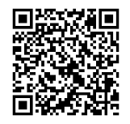
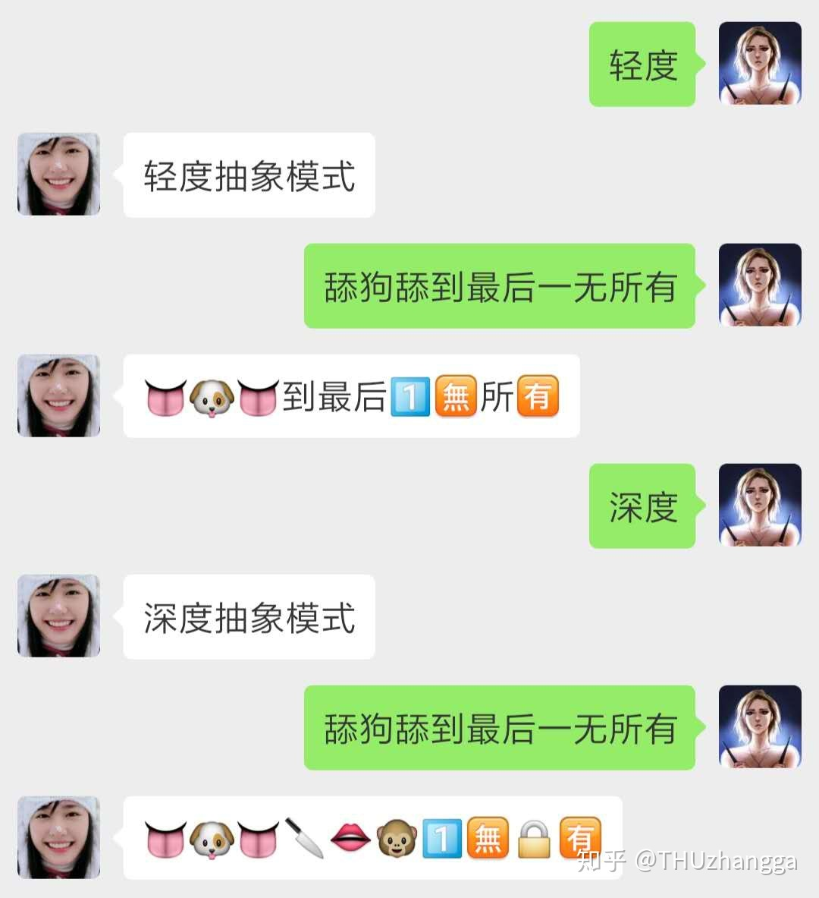
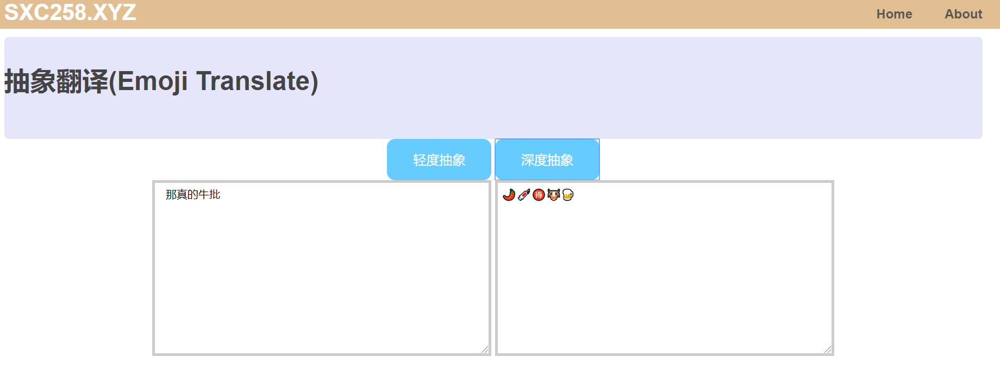
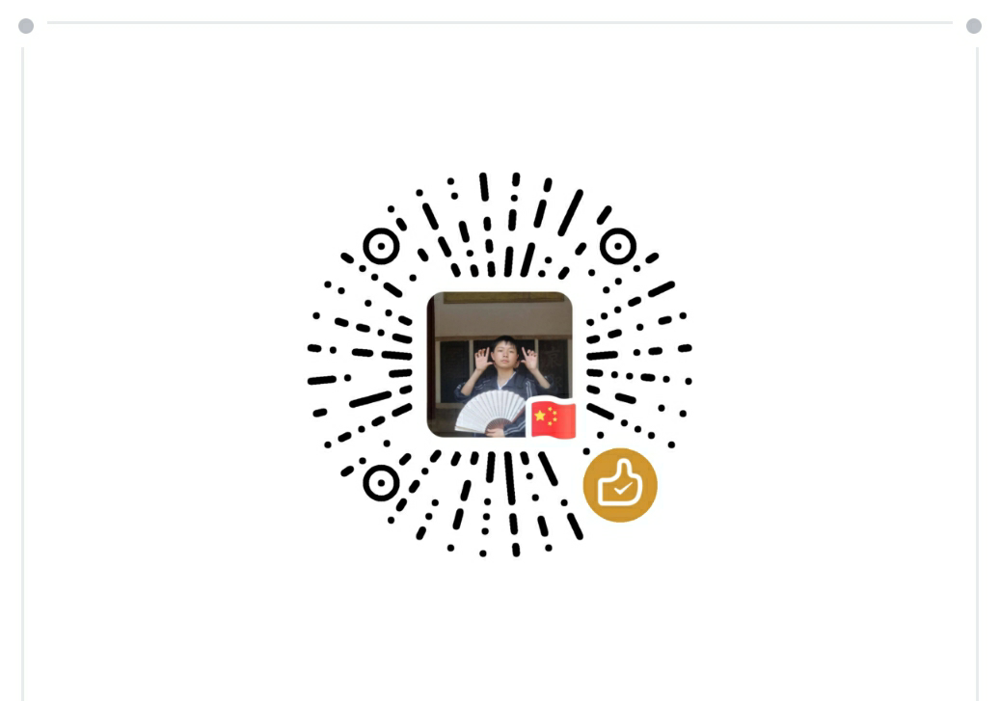

# NMSL

Never❤️Mind❤️the❤️Scandal❤️and❤️Liber

抽象话翻译工具：把你打的字都给你emoji咯！

## 运行平台

Python3

## 依赖库

jieba、pandas、pinyin

## 使用方式

`nmsl_local.text_to_emoji(text, method=1)`

* 参数：
  * `text: str`：待转换的文字。目前仅支持对中文和数字转换，英文将不会被转换。
  * `method: int`：转换模式，默认为1（深度抽象，见后文）

## 基本原理

* 抽象词典：原始词典有近500个词条，根据Emojipedia上的emoji的meaning，爬取的翻译，并手动更改了和增加了一些特色词条，囊括了广大狗粉丝熟知的一些典故。如：

  | 农民 | 🐲鸣  |
  | ---- | ---- |
  | 憨憨 | 🍔🍔   |

* 分词：利用`jieba`对原始文字进行分词

* **轻度抽象**：对分词后的词语，检索抽象词典，替换成对应emoji。若词语未找到，再对单个字进行检索。

* **深度抽象**：由于抽象词典有限，轻度抽象转换效果往往一般，因此增加对同音词的转换。

## 使用示例

原文：

> 苟利国家生死以，岂因祸福避趋之

轻度抽象

> 苟利国家生💀以，岂因祸福避趋之

深度抽象

> 🐶🎁国➕生💀1️⃣，7️⃣🎵🔥福🖊趋📄

## 微信公众号翻译：“水不在深有”

本人微信公众号：“水不在深有”，可翻译抽象话：

效果如图：

微信公众号的开发参见：https://zhuanlan.zhihu.com/p/46720483

项目主要依赖flask搭建后台应用，同时为保存用户信息，利用sqlite3，将用户名及抽象模式储存在`USERS.db`中。每次当有用户请求翻译时，将会先查找其微信名及抽象模式，再进行抽象。

## 网站翻译：sxc258.xyz

为方便使用，搭建了一个简陋的网页：http://sxc258.xyz/

本部分见：https://github.com/THUzhangga/NMSL-web

同样依托flask，并简单地使用了css及js。

## 联系作者

本项目为本人业余开发，若有商业合作请与作者联系（wechat：emcxMTMxNjkxNDYy，经base64加密）。

如果觉得活整得好，欢迎扫一哈打赏：

### 💊恰🍚🉐🐴